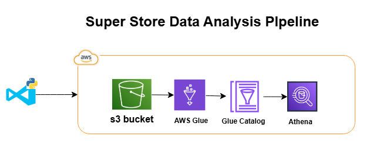

# Superstore-data-Analysis-Pipeline-(Serverless)

- **Azure DevOps**
- **AWS** 
    - **S3 bucket**
    - **AWS Glue**
    - **Glue Catalog**
    - **Athena**

## **Super Store Data Analysis Pipeline**

This project showcases a data analysis pipeline designed to analyze data from a fictional super store. The pipeline utilizes various AWS services to streamline data processing and analysis.

**Project Architecture:**

**Project Structure:**

* **Data:** Contains raw data files from the super store.
* **Scripts:** Houses Python scripts responsible for data processing and analysis.
* **Documentation:** Includes README.md and any additional project documentation.
* **Output:** Stores processed data and analysis results.

**Pipeline Components:**

- **Azure DevOps:** Serves as the deployment platform for the project.
- **AWS S3:** Stores the raw data files as a data lake.
- **AWS Glue:** Extracts, transforms, and loads (ETL) data from S3 into the Glue Catalog for easier querying.
- **Glue Catalog:** Acts as a data dictionary, providing metadata about the data stored in S3.
- **AWS Athena:** Query engine that allows for interactive analysis of data using SQL.

**Workflow:**

1. **Data Ingestion:** Raw data is uploaded to Azure DevOps.
2. **Data Transfer:** Azure DevOps pushes the data to the S3 bucket.
3. **Data Transformation:** AWS Glue ETL jobs process the data and load it into the Glue Catalog.
4. **Data Analysis:** Users can query the data using Athena, generating insights and reports.

**Benefits:**

* **Scalable Infrastructure:** AWS services provide a scalable and reliable platform for handling large data volumes.
* **Simplified Data Management:** Glue Catalog simplifies data access and understanding, improving data quality and consistency.
* **Cost-Effective Analysis:** Athena provides a pay-per-query model, reducing overall costs associated with data analysis.
* **Increased Productivity:** The streamlined workflow allows for faster data processing and analysis, enabling quicker insights.

**Future Enhancements:**

* Implement data visualization tools for interactive data exploration.
* Integrate with other AWS services like Redshift for more advanced analytics.
* Incorporate machine learning algorithms for predictive analysis.

**Project Contribution:**

Feel free to contribute to this project by:

* **Improving Data Processing:** Suggest new ETL techniques or optimization strategies.
* **Expanding Analysis Capabilities:** Add new queries or create custom reports.
* **Enhancing Documentation:** Improve the clarity and comprehensiveness of the project documentation.

This project serves as a foundation for understanding how to leverage AWS services for data analysis. With further enhancements and contributions, it can evolve into a robust

